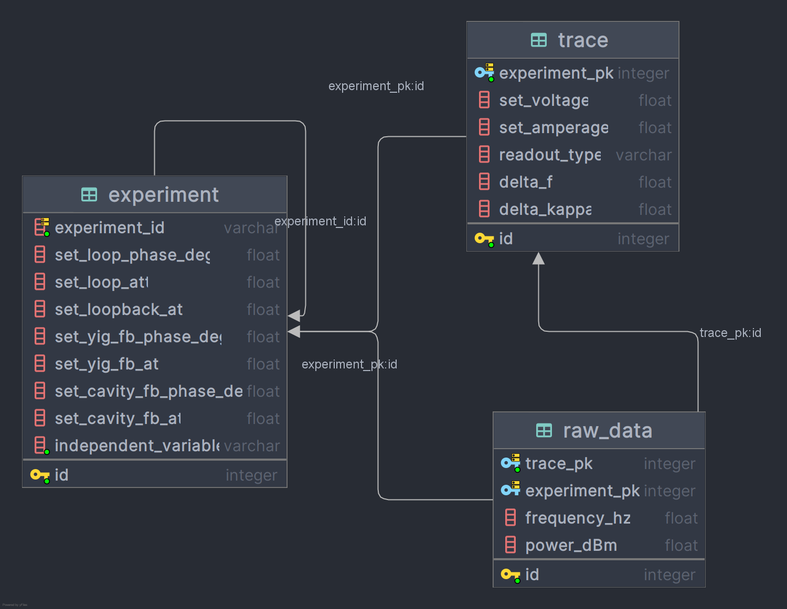
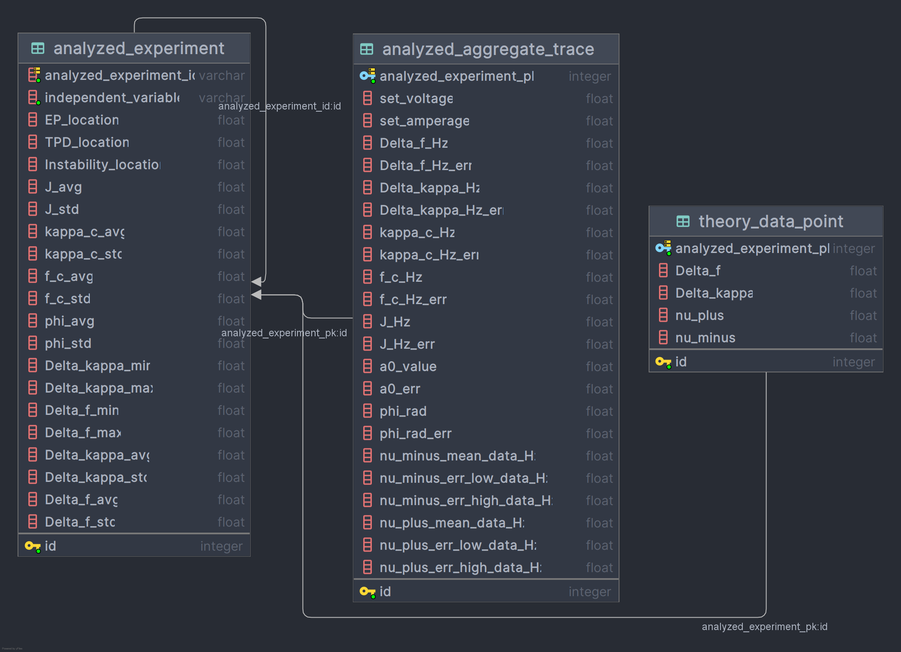

# EP-TPD Unification Project

This repository contains the code to analyze experimental data and generate figures for the EP-TPD Unification research paper. The project processes raw experimental data from the cavity-magnon system, performs data analysis to identify exceptional points (EPs) and transmission peak degeneracies (TPDs), and generates publication-quality figures.

## Installation

1. Clone this repository
2. Install dependencies (we recommend using a virtual environment):
   ```bash
   # Create a virtual environment
   python -m venv venv
   
   # Activate the virtual environment
   # On Windows:
   venv\Scripts\activate
   # On macOS/Linux:
   # source venv/bin/activate
   
   # Install dependencies
   pip install -r requirements.txt
   ```
   
   For more information on virtual environments, see:
   - [Python venv documentation](https://docs.python.org/3/library/venv.html)
   - [Conda environments](https://conda.io/projects/conda/en/latest/user-guide/tasks/manage-environments.html) (if you prefer using Conda)
3. Run the main script (Note, there is a lot of data to process, so this may take some time):
   ```bash
   python main.py
   ```

## Project Structure

The project is organized into several key directories:

```
EP_TPD_Unification/
├── main.py                # Main execution script
├── data/                  # Raw and transformed data
├── etl/                   # Extract, Transform, Load pipeline
├── models/                # Data models
├── figures/               # Figure generation scripts
├── fitting/               # Model fitting algorithms
├── errors/                # Custom error handling
└── theory/                # Theoretical calculations
```

## Getting Started

To run the full pipeline, execute the main script:

```bash
python main.py
```

The script performs the following operations:
1. Verifies that all required raw databases are present in the data directory
2. Checks if transformed data exists, and runs the ETL pipeline if needed
3. Generates all four figures for the research paper

If you want to force regeneration of the transformed data (for example, after changing analysis parameters), set the `FORCE_ETL` variable to `True` at the top of the main.py file.

## Data Files

TODO: Replace this with the links to download the databases from Zenodo/Git LFS/Dryad. The DB files are too large to be included
in this repo directly.

**Before we find a permanent home for the datasets, please download them from this shareable Dropbox link:** https://www.dropbox.com/scl/fo/mf0a0b37njk3fxiohd8h6/AIiZbizdXVbC4gj0lSXDnlY?rlkey=4v32ye26v5i53lbpwtc905ari&st=tup52m1z&dl=0

The `/data` directory contains:
- `ep_tpd_experiment_data.db`: Raw experimental measurements
- `fig1_raw_data.db`: Specific data for Figure 1
- `ep_tpd_transformed_data.db`: Generated through the ETL pipeline with analyzed results

## ETL Pipeline

The Extract, Transform, Load (ETL) pipeline in the `/etl` directory processes raw experimental data and generates analyzed datasets:

- `etl_pipeline.py`: Main ETL processing script
- `settings.py`: Configuration parameters for the ETL process
- `etl_config.json`: Experiment-specific configuration
- `simulate_theory.py`: Generates theoretical comparison data

The ETL pipeline performs:
1. Extraction of raw data from databases
2. Fitting of cavity and YIG traces with Lorentzian models
3. Coupled model fitting with uncertainty propagation
4. Theory data generation
5. Transformation and storage of analyzed results

## Figure Generation

The `/figures` directory contains scripts to generate each figure from the paper:

- `/figure_1_platform`: Experimental platform visualization
- `/figure_2_theory`: Theoretical predictions and phase diagrams
- `/figure_3_experiment`: Experimental results showing EPs and TPDs
- `/figure_4_metrics`: Performance metrics and comparisons

Each figure directory may contain a `settings.py` file that allows customization of plot parameters, color schemes, and other visualization options without changing the core plotting code.

## Customization

Throughout the project, there are several ways to customize the analysis and visualization:

1. **ETL Settings**: Modify `etl/settings.py` to change analysis parameters such as:
   - Monte Carlo simulation shots
   - Error bar scale factors
   - Debug plot generation

2. **Figure Settings**: Each figure directory may contain a `settings.py` file for customizing:
   - Plot dimensions and styling
   - Color schemes
   - Axis limits and labels

3. **Main Configuration**: At the top of `main.py`, you can set:
   - `FORCE_ETL`: Set to `True` to regenerate all transformed data

## Models

The `/models` directory contains the data model definitions:

- `/models/experiment`: Raw experimental data models
- `/models/analysis`: Processed data models after fitting

### Database Schema

#### Raw Experimental Data



*The diagram above illustrates the database schema used in this project, showing the relationships between experiments, traces, and raw data.*

#### Processed Analysis Data

We choose to separate raw and processed data into different databases to maintain data integrity and allow for easier updates to analysis methods without altering the original measurements.



*The diagram above illustrates the schema for processed analysis data, including fitted parameters and theoretical results.*

The data for Fig 1 was taken using an outdated method, and thus is stored in a separate database (`fig1_raw_data.db`) with its own simplified schema.

## Fitting

The `/fitting` directory contains algorithms for:

- `model_fitting.py`: Functions for fitting experimental data to theoretical models
- `peak_fitting.py`: Algorithms for identifying and characterizing spectral peaks
- `transition_fitting.py`: Methods for locating transition points (EPs and TPDs)

## Dependencies

This project requires:
- Python 3.9+
- NumPy, SciPy, Matplotlib
- SQLAlchemy for database operations
- Pandas for data manipulation

## Theory

The `/theory` directory includes scripts for theoretical calculations relevant to cavity-magnon systems.

We use MATLAB symbolic toolbox for all equations and include a `.mlx` file here. For those without a MATLAB license, we include a compiled PDF of the outputs.
